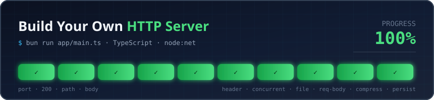

# Build an HTTP Server

[](https://app.codecrafters.io/users/usfmah?r=2qF)

A minimal HTTP/1.1 server built from scratch in TypeScript (Bun) for the [CodeCrafters "Build Your Own HTTP Server" challenge](https://app.codecrafters.io/courses/http-server/overview).

## Features

- TCP server on `localhost:4221` using `node:net`
- Manual HTTP request parsing (request-line)
- Routing:
  - `GET /` → `200 OK`
  - `GET /echo/<str>` → `200 OK` with the string echoed back as body
  - `GET /user-agent` → `200 OK` with `User-Agent` header value
  - anything else → `404 Not Found`
- Concurrent connections via Node event loop (per-socket buffer)

## Run

```sh
./your_program.sh
```

Then test with:

```sh
curl -v http://localhost:4221/
curl -v http://localhost:4221/echo/hello
```

## Submit

```sh
codecrafters submit
```

## Progress

- [x] Bind to a port
- [x] Respond with 200
- [x] Extract URL path
- [x] Respond with body
- [x] Read header (`/user-agent`)
- [x] Concurrent connections (per-socket buffer + event loop)
- [ ] Return a file
- [ ] Read request body
- [ ] HTTP Compression
  - [ ] Compression headers
  - [ ] Multiple compression schemes
  - [ ] Gzip compression
- [ ] Persistent Connections
  - [ ] Persistent connections
  - [ ] Concurrent persistent connections
  - [ ] Connection closure
